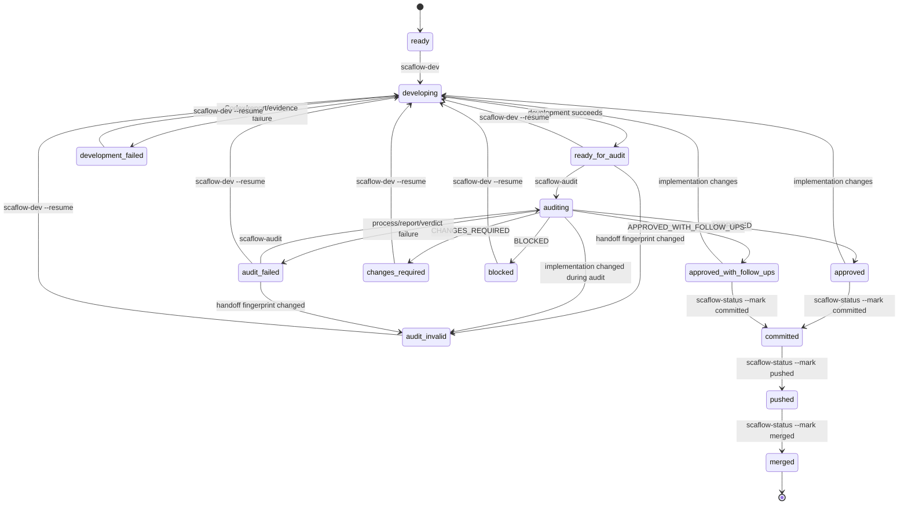

# Bootstrap Workflow State Machine

This state machine coordinates the repository-level development, audit, and delivery helpers before Scaflow v0.1.0 has its formal SQLite TaskRun state store and Orchestrator.

It is local bootstrap workflow state, not the final shared Task Definition State.

## Storage

For each task:

```text
.scaflow/handoffs/<task-id>/
├── state.json
├── events.jsonl
├── handoff.json
├── developer-report.md
├── audit-round-1.md
├── audit-round-1.json
└── ...
```

- `state.json` is the current snapshot.
- `events.jsonl` is an append-only transition log.
- reports and metadata are supporting evidence.
- `.scaflow/` is Git-ignored local runtime data.

## State model



## State meanings

### `ready`

The local workflow has not started. The Task Contract must still be `definition_state: ready` and all dependencies must be complete before development is actually runnable.

### `developing`

The developer Agent is active. Independent audit must not start.

### `development_failed`

The development process exited unsuccessfully, failed to create the developer report, or produced no implementation changes relative to the frozen base.

### `ready_for_audit`

Development, the declared Task Gate, and developer self-review have completed. This does not mean the implementation is approved or the shared Task is complete.

### `auditing`

The read-only Auditor is active. The implementation must remain frozen.

### `audit_failed`

The auditor process failed, no report was produced, or the report did not end with a recognized verdict. A new audit may run against the unchanged developer handoff, or development may resume.

### `audit_invalid`

The developer handoff fingerprint changed before audit, or the implementation changed during audit. The audit report cannot be used as approval evidence. Development must resume and rerun the complete Task Gate before another audit.

### `changes_required`

The Auditor returned `CHANGES_REQUIRED`. Development must resume and a new audit round is required.

### `blocked`

The Auditor returned `BLOCKED`. Development may resume only after resolving the blocking condition within the approved task scope.

### `approved_with_follow_ups`

The implementation is approved with bounded follow-up items. A human decides whether those follow-ups permit delivery.

### `approved`

The exact implementation fingerprint was independently approved.

### `committed`

The approved implementation is committed, the working tree is clean, and the commit still matches the approved fingerprint.

### `pushed`

The recorded implementation commit is present in the current branch upstream.

### `merged`

The recorded implementation commit is contained in the selected merge target ref. The original frozen development `baseRef` and `baseCommit` remain unchanged; the observed target ref and target commit are recorded separately as `delivery.mergeBaseRef` and `delivery.mergeBaseCommit`.

This marks the local bootstrap workflow complete. Only now may the shared Task Contract be updated separately to:

```yaml
definition_state: completed
```

## Completion boundaries

```text
development finished  = ready_for_audit
audit passed          = approved / approved_with_follow_ups
local delivery done   = merged
shared Task complete  = contract definition_state updated to completed
```

The helpers never automatically change the shared Task Contract.

## Implementation fingerprints

The workflow calculates a SHA-256 fingerprint from:

- the frozen base commit;
- the resulting implementation snapshot for all paths present in the frozen base, the current Git index, or the untracked non-ignored file set;
- each current file's normalized path, content, executable mode, or symlink target;
- explicit missing markers for deleted base paths.

Files under `.scaflow/` are ignored and therefore do not change the implementation fingerprint.

The snapshot representation is independent of whether the same content is untracked, staged, or committed. This allows the approved implementation fingerprint to remain stable after a correct commit.

The fingerprint is used to ensure:

- development handoff and audit inspect the same implementation;
- implementation cannot change during audit;
- the committed result matches the audited result;
- an approval becomes stale when implementation content changes.

## Event log

Every transition appends one JSON object to `events.jsonl`:

```json
{"at":"2026-06-06T08:00:00.000Z","event":"DEVELOPMENT_STARTED","from":"ready","to":"developing","metadata":{}}
```

The log is append-only and is intended to migrate later into Scaflow's formal SQLite Event Log.

## Commands

Start or resume development:

```bash
pnpm scaflow-dev SFL-001 --base main
pnpm scaflow-dev SFL-001 --base main --resume
```

Audit:

```bash
pnpm scaflow-audit SFL-001 --base main
```

Query state:

```bash
pnpm scaflow-status SFL-001
pnpm scaflow-status SFL-001 --json
```

Record verified delivery transitions:

```bash
# Run after creating the approved commit on the task branch
pnpm scaflow-status SFL-001 --mark committed

# Run after pushing the task branch and setting its upstream
pnpm scaflow-status SFL-001 --mark pushed

# Run after the implementation commit is merged and the target ref is current;
# this may be run after switching away from the task branch.
pnpm scaflow-status SFL-001 --base origin/main --mark merged
```

The status command verifies Git conditions before accepting each transition. It does not perform commit, push, merge, or Task Contract updates itself.

The automatic merged check requires the recorded implementation commit to remain an ancestor of the selected merge target. Squash merges that replace the implementation commit with a new commit are not automatically supported by this bootstrap checker.

## Legacy implementation import

For work completed before this state machine existed, the first real `scaflow-audit` run may import the current branch implementation directly into `ready_for_audit` when:

- no state file exists, or state is still `ready`;
- the implementation contains changes relative to the frozen base.

The import is recorded as `LEGACY_DEVELOPMENT_IMPORTED` and marked in `state.json`.

`--dry-run` never writes or imports state.

## Bootstrap limitation

This workflow currently operates in one dedicated task branch and local checkout. When Scaflow's formal TaskRun Workspace, State Store, Event Log, and Orchestrator are implemented, these semantics should move into the Engine while preserving the same distinctions between development completion, audit approval, delivery, and shared Task completion.
